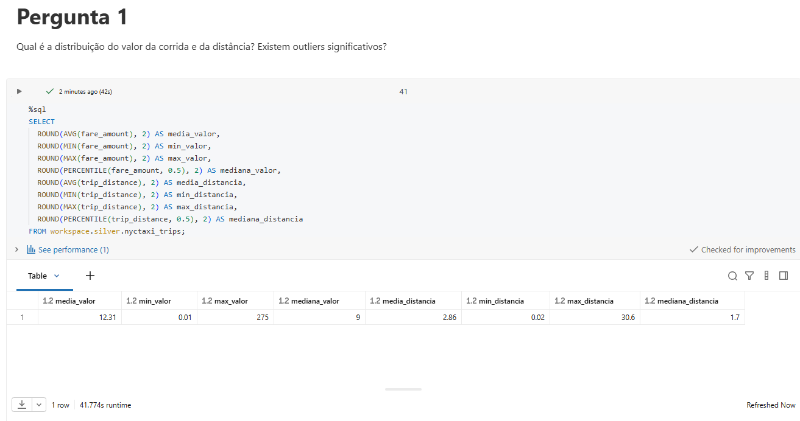
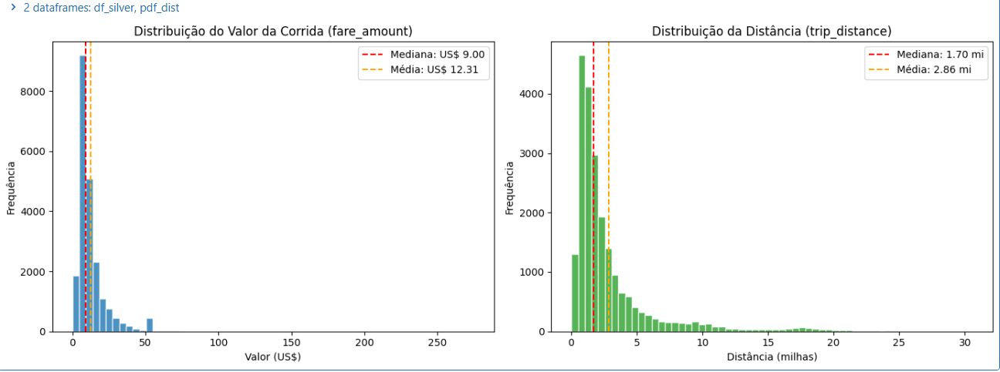
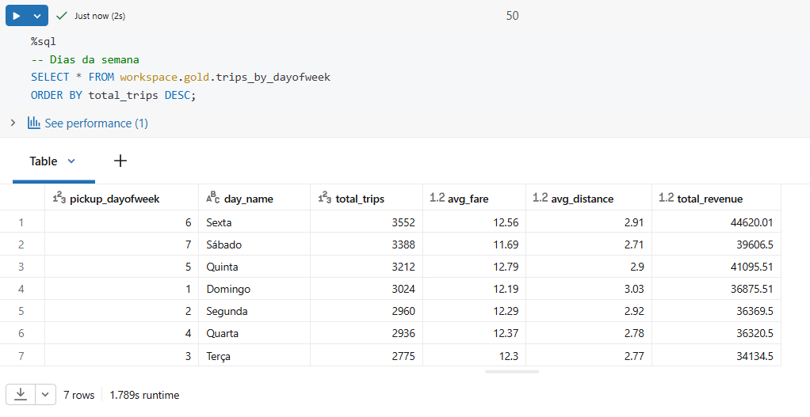
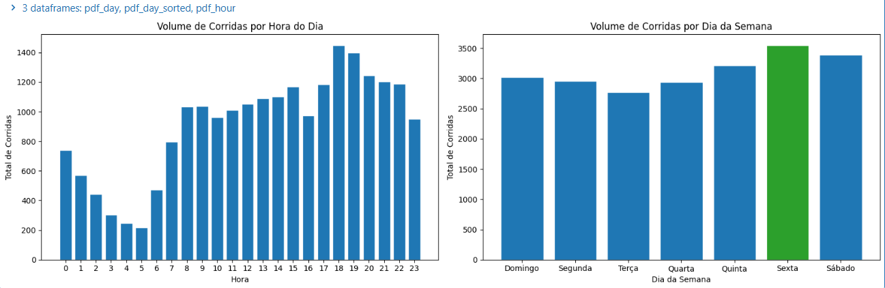
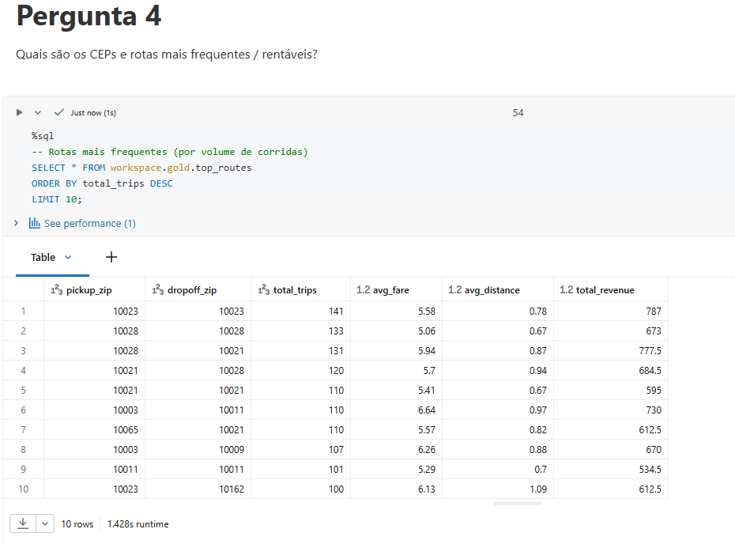
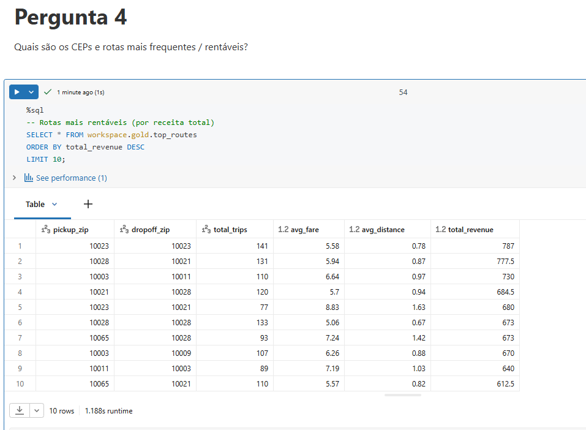
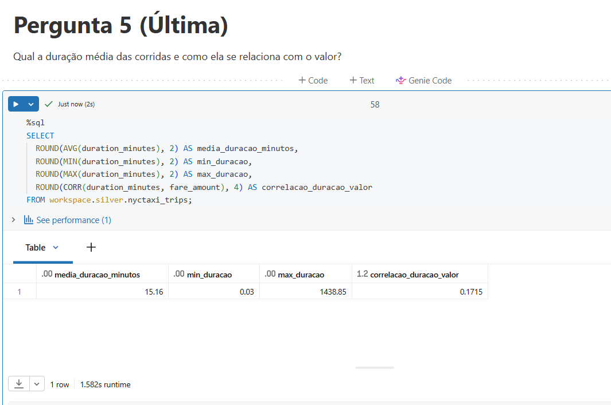

# Aluno:
Gusthavo Silva de Oliveira (Matrícula: 4052026000142)

### Nota Importante Minha
Consegui executar o trabalho com o auxílio da IA do próprio Notebook, que avaliava meus erros de sintaxe e ajudava na lógica (e mesmo assim não saímos ilesos, conforme se poderá ver na seção das perguntas). Isso é tudo, obrigado.

# MVP: Pipeline de Dados na Nuvem – NYC Taxi (Databricks)

Pipeline de dados completo utilizando a **Arquitetura Medalhão** (Bronze → Silver → Gold) sobre o dataset público `samples.nyctaxi.trips` no Databricks Free Edition.

[Link do dataset](https://docs.databricks.com/aws/en/discover/databricks-datasets#nyctaxi)

---

## 1. Contexto de Negócios e Perguntas (Etapa 2 e 4.1)

### Problema / Contexto
O objetivo deste trabalho é construir um pipeline de dados na nuvem para analisar o padrão de uso e precificação das corridas de táxi em Nova York.  
A partir dos dados disponíveis no dataset `samples.nyctaxi.trips`, buscamos identificar os principais fatores que influenciam o valor da corrida, os horários e locais de maior demanda, e possíveis problemas de qualidade nos dados.  

Os insights gerados podem apoiar decisões de otimização de frota, precificação dinâmica ou planejamento urbano.

### Fonte dos Dados
- **Dataset:** `samples.nyctaxi.trips` (Databricks Public Datasets)
- **Licença:** Uso livre para fins educacionais e de aprendizado
- **Conteúdo:** Registros de corridas de táxi amarelo (Yellow Cab) de Nova York, contendo data/hora de embarque e desembarque, distância, valor da corrida e CEPs de origem/destino.
- **Volume:** 21.932 registros | 6 colunas originais

### Perguntas de Negócio
1. Qual é a distribuição do valor da corrida e da distância? Existem outliers significativos?
2. Existe correlação clara entre distância percorrida e valor da corrida? Qual a força dessa relação?
3. Quais são os horários do dia e dias da semana com maior volume de corridas e maior valor médio?
4. Quais são os CEPs de origem e destino mais frequentes? Existem rotas especialmente rentáveis?
5. Qual a duração média das corridas e como ela se relaciona com o valor cobrado?

---

## 2. Carga dos Dados (Etapa 4.2)

Os dados já estavam disponíveis no catálogo `samples` do Databricks.  
Foi realizada a carga para a camada Bronze adicionando metadados de rastreabilidade (`ingestion_timestamp` e `source_table`).

**Evidências:**

---

## 3. Modelagem e Catálogo de Dados (Etapa 4.3)

Foi utilizada a **Arquitetura Medalhão**:

- **Bronze:** dado bruto + metadados de linhagem  
- **Silver:** dado limpo + colunas derivadas  
- **Gold:** tabelas agregadas prontas para consumo

### Catálogo de Dados

#### Tabela de origem: `samples.nyctaxi.trips`

| Coluna | Tipo | Significado |
|--------|------|-----------|
| tpep_pickup_datetime | timestamp | Momento em que o passageiro entrou no táxi |
| tpep_dropoff_datetime | timestamp | Momento em que o passageiro saiu do táxi |
| trip_distance | double | Distância percorrida em milhas |
| fare_amount | double | Valor da tarifa base em dólares |
| pickup_zip | int | CEP de embarque |
| dropoff_zip | int | CEP de desembarque |

#### Camada Bronze: `workspace.bronze.nyctaxi_trips`
Cópia bruta + metadados de rastreabilidade.

| Coluna | Tipo | Significado |
|--------|------|-----------|
| ... (mesmas colunas da origem) | | |
| ingestion_timestamp | timestamp | Data/hora em que o dado foi ingerido |
| source_table | string | Tabela de origem |

#### Camada Silver: `workspace.silver.nyctaxi_trips`
Dados limpos + colunas derivadas.

| Coluna | Tipo | Significado |
|--------|------|-----------|
| duration_minutes | decimal | Duração da corrida em minutos |
| pickup_hour | int | Hora do dia (0-23) |
| pickup_dayofweek | int | Dia da semana (1=Domingo ... 7=Sábado) |

#### Camada Gold
- `workspace.gold.trips_by_hour`
- `workspace.gold.trips_by_dayofweek`
- `workspace.gold.top_routes`

**Evidências do Catálogo / Estrutura:**

---

## 4. Pipeline de Dados (Etapa 4.4)

O pipeline foi construído em um único notebook, organizado em seções claras:

1. Exploração da fonte  
2. Criação dos schemas (bronze, silver, gold)  
3. Carga Bronze  
4. Análise de Qualidade  
5. Transformação Silver  
6. Criação das tabelas Gold  
7. Respostas às perguntas de negócio  

**Fluxo:**

samples.nyctaxi.trips

→ workspace.bronze.nyctaxi_trips

→ workspace.silver.nyctaxi_trips

→ workspace.gold.trips_by_hour

→ workspace.gold.trips_by_dayofweek

→ workspace.gold.top_routes

**Evidências:**

---

## 5. Qualidade de Dados (Etapa 4.5)

### Problemas encontrados na Bronze:
- 76 registros com distância ≤ 0  
- 10 registros com valor ≤ 0 (incluindo valores negativos)  
- 1 registro com duração inválida (dropoff ≤ pickup)  
- Nenhum valor nulo  
- Sem outliers extremos de distância ou valor  

### Tratamentos aplicados na Silver:
- Remoção dos 85 registros inválidos (taxa de rejeição ≈ 0,39%)  
- Criação das colunas derivadas (`duration_minutes`, `pickup_hour`, `pickup_dayofweek`)

**Evidências:**

---

## 6. Análise de Dados (Etapa 4.5)

### Pergunta 1 – Distribuição e Outliers
A distribuição é assimétrica à direita. A maioria das corridas é curta e de baixo valor, enquanto poucos outliers elevam a média.

### Pergunta 2 – Correlação Distância × Valor
Correlação de **0,9473** → relação muito forte e positiva.

### Pergunta 3 – Horários e Dias de Pico
- Pico de demanda: **18h–19h**
- Dia mais forte: **Sexta-feira**
- Dia mais fraco: **Terça-feira**

  

### Pergunta 4 – Rotas mais frequentes e rentáveis
As rotas mais comuns são curtas e intra-bairros de Manhattan (especialmente Upper East Side e Upper West Side).

  

### Pergunta 5 – Duração média
Duração média ≈ **15,16 minutos**. Correlação com o valor é fraca (0,17), confirmando que a distância é o fator dominante.

### Discussão Geral
O pipeline revelou um padrão claro de uso urbano em Manhattan: corridas curtas, alta correlação distância-preço, picos no final da tarde e às sextas-feiras. A qualidade dos dados era boa, exigindo apenas limpeza leve.

---

## 7. Autoavaliação

- Consegui responder todas as perguntas formuladas inicialmente.
- Deixei passar desapercebido: se tivesse um limite mais claro, seria possível filtrar o outlier extremo de duração (1438 minutos).
