# MVP: Pipeline de Dados na Nuvem – NYC Taxi (Databricks)

Pipeline de dados completo utilizando a **Arquitetura Medalhão** (Bronze → Silver → Gold) sobre o dataset público `samples.nyctaxi.trips` no Databricks Free Edition.

---

## 1. Contexto de Negócios e Perguntas (Etapa 2 e 4.1)

### Problema / Contexto
O objetivo deste trabalho é construir um pipeline de dados na nuvem para analisar o padrão de uso e precificação das corridas de táxi em Nova York.  
A partir dos dados disponíveis no dataset `samples.nyctaxi.trips`, buscamos identificar os principais fatores que influenciam o valor da corrida, os horários e locais de maior demanda, e possíveis problemas de qualidade nos dados.  

Os insights gerados podem apoiar decisões de otimização de frota, precificação dinâmica ou planejamento urbano.

### Fonte dos Dados
- **Dataset:** `samples.nyctaxi.trips` (Databricks Public Datasets)
- **Licença:** Uso livre para fins educacionais e de aprendizado
- **Conteúdo:** Registros de corridas de táxi amarelo (Yellow Cab) de Nova York, contendo data/hora de embarque e desembarque, distância, valor da corrida e CEPs de origem/destino.
- **Volume:** 21.932 registros | 6 colunas originais

### Perguntas de Negócio
1. Qual é a distribuição do valor da corrida e da distância? Existem outliers significativos?
2. Existe correlação clara entre distância percorrida e valor da corrida? Qual a força dessa relação?
3. Quais são os horários do dia e dias da semana com maior volume de corridas e maior valor médio?
4. Quais são os CEPs de origem e destino mais frequentes? Existem rotas especialmente rentáveis?
5. Qual a duração média das corridas e como ela se relaciona com o valor cobrado?

---

## 2. Carga dos Dados (Etapa 4.2)

Os dados já estavam disponíveis no catálogo `samples` do Databricks.  
Foi realizada a carga para a camada Bronze adicionando metadados de rastreabilidade (`ingestion_timestamp` e `source_table`).

**Evidências:**

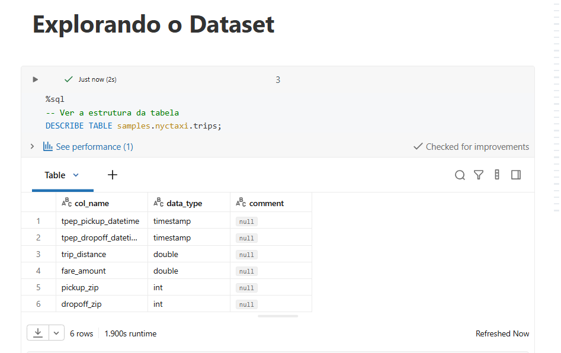

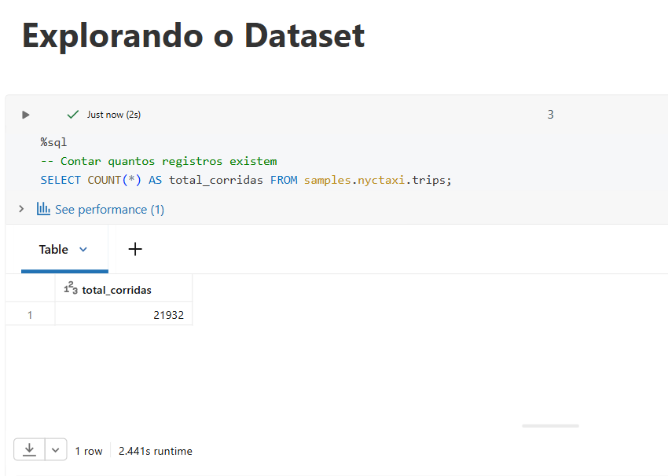

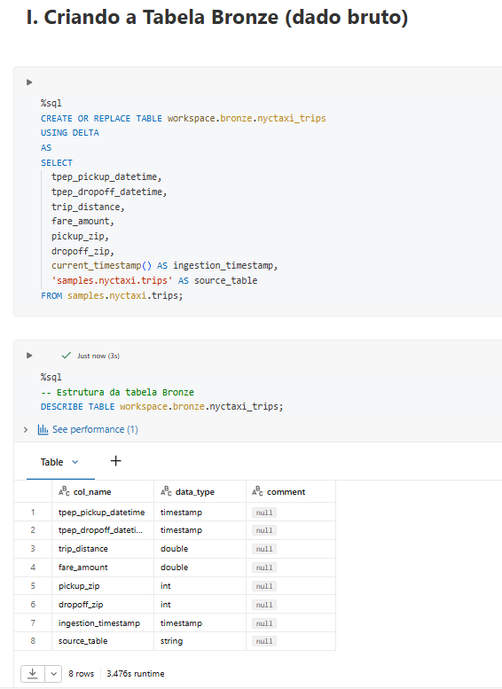

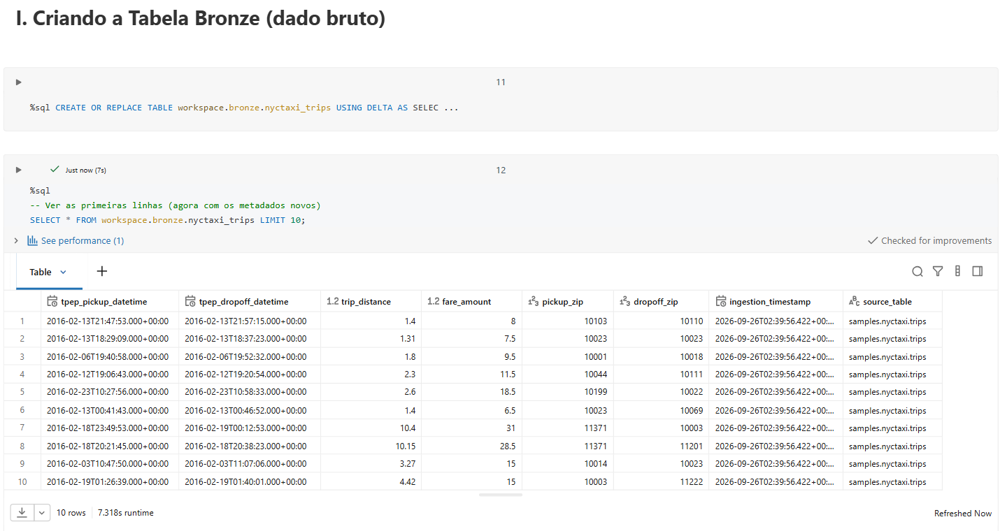

---

## 3. Modelagem e Catálogo de Dados (Etapa 4.3)

Foi utilizada a **Arquitetura Medalhão**:

- **Bronze:** dado bruto + metadados de linhagem  
- **Silver:** dado limpo + colunas derivadas  
- **Gold:** tabelas agregadas prontas para consumo

### Catálogo de Dados

#### Tabela de origem: `samples.nyctaxi.trips`

| Coluna | Tipo | Significado |
|--------|------|-----------|
| tpep_pickup_datetime | timestamp | Momento em que o passageiro entrou no táxi |
| tpep_dropoff_datetime | timestamp | Momento em que o passageiro saiu do táxi |
| trip_distance | double | Distância percorrida em milhas |
| fare_amount | double | Valor da tarifa base em dólares |
| pickup_zip | int | CEP de embarque |
| dropoff_zip | int | CEP de desembarque |

#### Camada Bronze: `workspace.bronze.nyctaxi_trips`
Cópia bruta + metadados de rastreabilidade.

| Coluna | Tipo | Significado |
|--------|------|-----------|
| ... (mesmas colunas da origem) | | |
| ingestion_timestamp | timestamp | Data/hora em que o dado foi ingerido |
| source_table | string | Tabela de origem |

#### Camada Silver: `workspace.silver.nyctaxi_trips`
Dados limpos + colunas derivadas.

| Coluna | Tipo | Significado |
|--------|------|-----------|
| duration_minutes | decimal | Duração da corrida em minutos |
| pickup_hour | int | Hora do dia (0-23) |
| pickup_dayofweek | int | Dia da semana (1=Domingo ... 7=Sábado) |

#### Camada Gold
- `workspace.gold.trips_by_hour`
- `workspace.gold.trips_by_dayofweek`
- `workspace.gold.top_routes`

**Evidências do Catálogo / Estrutura:**

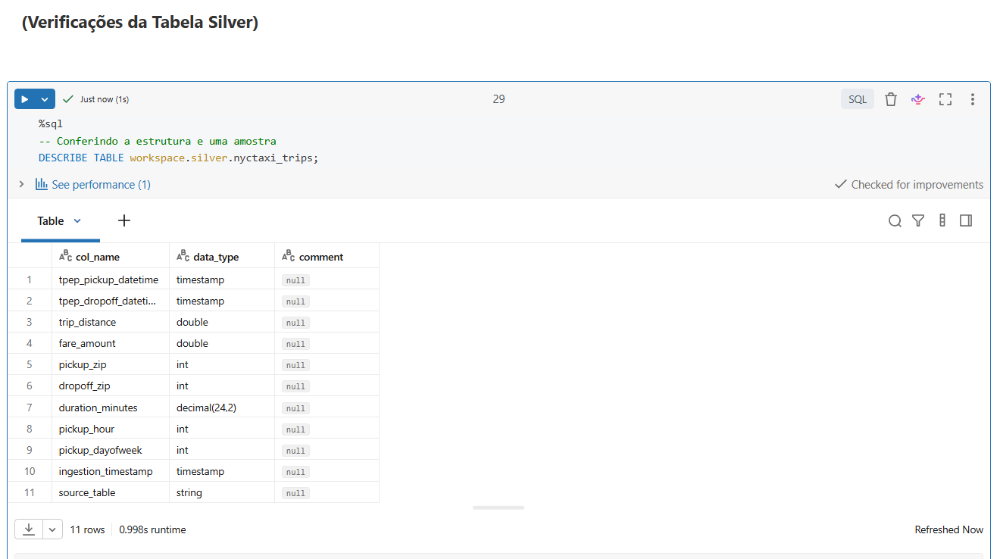

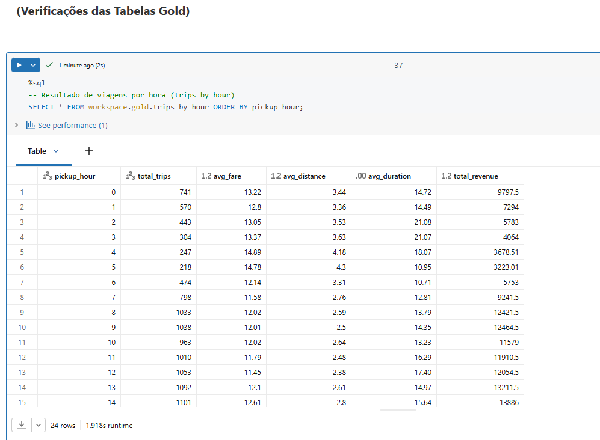

---

## 4. Pipeline de Dados (Etapa 4.4)

O pipeline foi construído em um único notebook, organizado em seções claras:

1. Exploração da fonte  
2. Criação dos schemas (bronze, silver, gold)  
3. Carga Bronze  
4. Análise de Qualidade  
5. Transformação Silver  
6. Criação das tabelas Gold  
7. Respostas às perguntas de negócio  

**Fluxo:**

samples.nyctaxi.trips

→ workspace.bronze.nyctaxi_trips

→ workspace.silver.nyctaxi_trips

→ workspace.gold.trips_by_hour

→ workspace.gold.trips_by_dayofweek

→ workspace.gold.top_routes

**Evidências:**

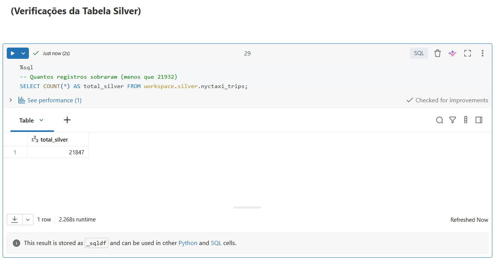

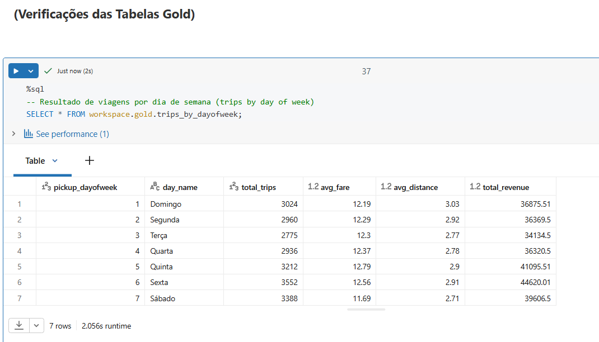

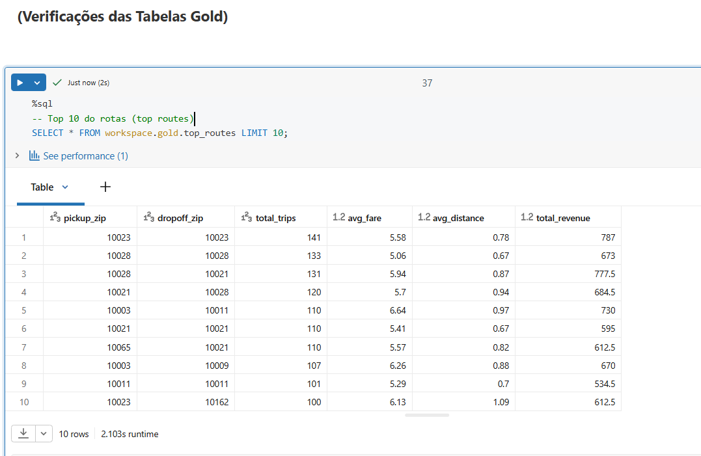

---

## 5. Qualidade de Dados (Etapa 4.5)

### Problemas encontrados na Bronze:
- 76 registros com distância ≤ 0  
- 10 registros com valor ≤ 0 (incluindo valores negativos)  
- 1 registro com duração inválida (dropoff ≤ pickup)  
- Nenhum valor nulo  
- Sem outliers extremos de distância ou valor  

### Tratamentos aplicados na Silver:
- Remoção dos 85 registros inválidos (taxa de rejeição ≈ 0,39%)  
- Criação das colunas derivadas (`duration_minutes`, `pickup_hour`, `pickup_dayofweek`)

**Evidências:**

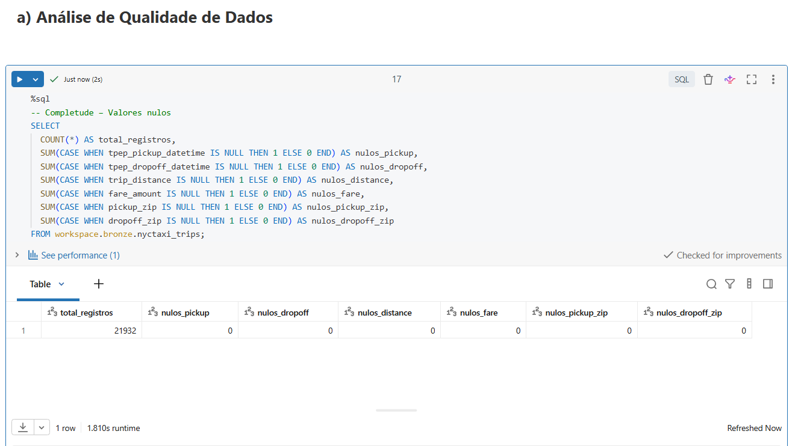

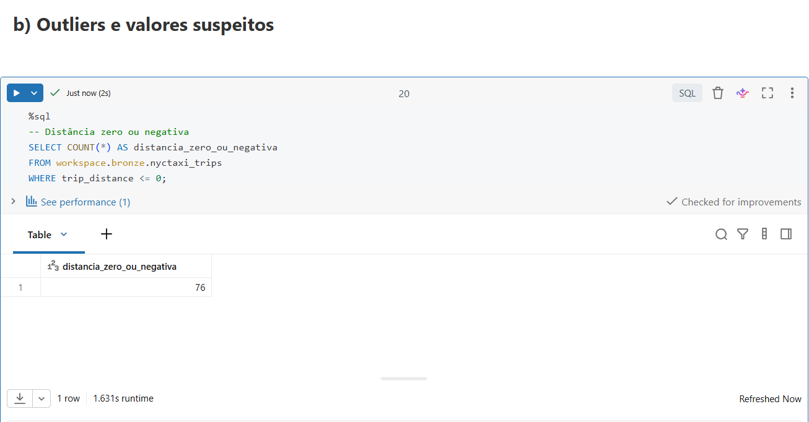

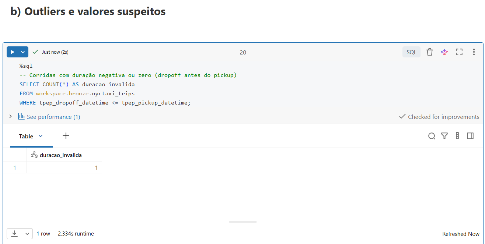

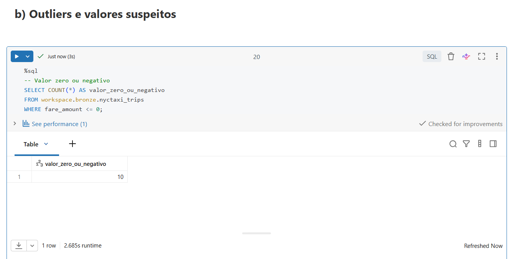

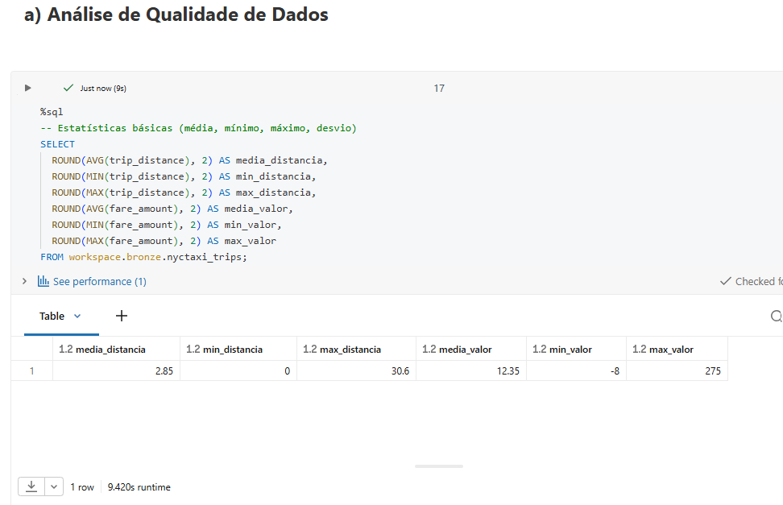

---

## 6. Análise de Dados (Etapa 4.5)

### Pergunta 1 – Distribuição e Outliers
A distribuição é assimétrica à direita. A maioria das corridas é curta e de baixo valor, enquanto poucos outliers elevam a média.

### Pergunta 2 – Correlação Distância × Valor
Correlação de **0,9473** → relação muito forte e positiva.

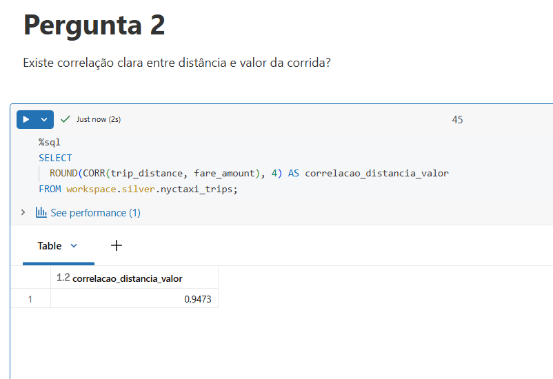

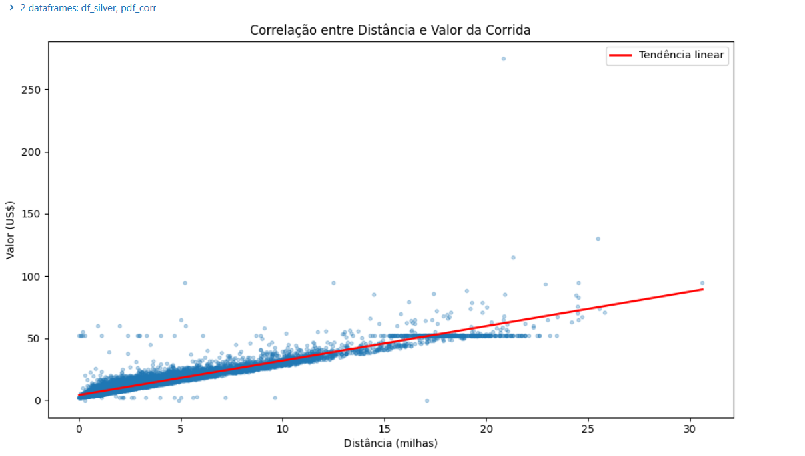

### Pergunta 3 – Horários e Dias de Pico
- Pico de demanda: **18h–19h**
- Dia mais forte: **Sexta-feira**
- Dia mais fraco: **Terça-feira**

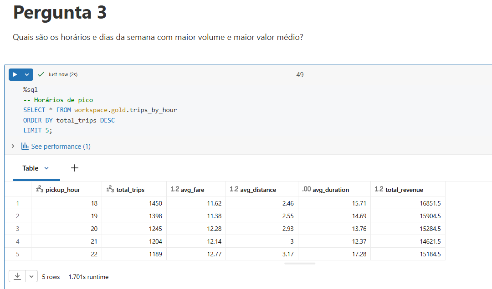  

### Pergunta 4 – Rotas mais frequentes e rentáveis
As rotas mais comuns são curtas e intra-bairros de Manhattan (especialmente Upper East Side e Upper West Side).

  

### Pergunta 5 – Duração média
Duração média ≈ **15,16 minutos**. Correlação com o valor é fraca (0,17), confirmando que a distância é o fator dominante.

### Discussão Geral
O pipeline revelou um padrão claro de uso urbano em Manhattan: corridas curtas, alta correlação distância-preço, picos no final da tarde e às sextas-feiras. A qualidade dos dados era boa, exigindo apenas limpeza leve.

---

## 7. Autoavaliação

- Consegui responder todas as perguntas formuladas inicialmente.
- Deixar passar desapercebido: se tivesse um limite mais claro, seria possível filtrar o outlier extremo de duração (1438 minutos).

---

## Estrutura do Repositório

- `notebook/` → Notebook completo do pipeline
- `images/` → Todas as evidências (screenshots)
- `README.md` → Esta documentação

# mpv_taxi_ny_dt
Estudo de banco de **dados** de taxis em Nova Iorque

[Link do dataset](https://docs.databricks.com/aws/en/discover/databricks-datasets#nyctaxi)

## Contexto de Negócios e Perguntas (Etapa 2 e 4.1)

### Problema / Contexto
O objetivo deste trabalho é construir um pipeline de dados na nuvem (usando a arquitetura Medalhão) para analisar o padrão de uso e precificação das corridas de táxi em Nova York.

A partir dos dados de corridas disponíveis no dataset `samples.nyctaxi.trips`, identifico os principais fatores que influenciam o valor da corrida, os horários e locais de maior demanda, e possíveis inconsistências de qualidade nos dados.

Os insights gerados podem apoiar decisões de otimização de frota, precificação dinâmica ou planejamento urbano.

### Fonte dos Dados
- Dataset: `samples.nyctaxi.trips` (Databricks Public Datasets); tabela com registros de corridas de táxi de Nova York contendo data/hora de embarque e desembarque, distância, valor da corrida e CEPs de origem e destino.

### Perguntas de Negócio
1. Qual é a distribuição do valor da corrida e da distância? Existem outliers, pontos fora da curva, significativos?
2. Existe correlação clara entre distância percorrida e valor da corrida? Qual a força dessa relação?
3. Quais são os horários do dia e dias da semana com maior volume de corridas e maior valor médio?
4. Qual a duração média das corridas e como ela se relaciona com o valor cobrado?
5. Quais são os CEPs de origem e destino mais frequentes? Existem rotas especialmente rentáveis?

### Legenda: Variáveis e Tabelas do Pipeline

Esta seção descreve o significado completo de cada coluna e tabela utilizada no notebook, do dado bruto às agregações finais.

#### Tabela de origem: `samples.nyctaxi.trips`
Dataset público de corridas de táxi amarelo (Yellow Cab) da cidade de Nova York, disponibilizado pela Databricks.

| Coluna | Tipo | Significado |
| --- | --- | --- |
| `tpep_pickup_datetime` | timestamp | Momento exato em que o passageiro entrou no táxi (início da corrida). *TPEP* significa *Taxi and Limousine Commission Passenger Enhancement Program*, o sistema de registradores eletrônicos instalados nos veículos. |
| `tpep_dropoff_datetime` | timestamp | Momento exato em que o passageiro saiu do táxi (fim da corrida). |
| `trip_distance` | double | Distância percorrida durante a corrida, medida em milhas, registrada pelo taxímetro do veículo. |
| `fare_amount` | double | Valor da tarifa cobrada do passageiro pelo taxímetro, em dólares americanos. Não inclui gorjetas, pedágios ou adicionais — apenas a tarifa base calculada por distância e tempo. |
| `pickup_zip` | int | Código postal (ZIP code) da zona onde o passageiro foi embarcado. Corresponde a áreas de Manhattan e arredores. |
| `dropoff_zip` | int | Código postal da zona onde o passageiro foi desembarcado. |

#### Camada Bronze: `workspace.bronze.nyctaxi_trips`
Cópia bruta dos dados de origem, projetada com metadados de rastreabilidade. Nenhuma transformação de valor é aplicada; o objetivo é preservar o dado exatamente como chegou.

| Coluna | Tipo | Significado |
| --- | --- | --- |
| `tpep_pickup_datetime` | timestamp | Momento exato do início da corrida. |
| `tpep_dropoff_datetime` | timestamp | Momento exato do fim da corrida. |
| `trip_distance` | double | Distância percorrida em milhas. |
| `fare_amount` | double | Tarifa base em dólares. |
| `pickup_zip` | int | CEP do embarque. |
| `dropoff_zip` | int | CEP do desembarque. |
| `ingestion_timestamp` | timestamp | Carimbo de data/hora gerado automaticamente no momento em que o dado foi copiado para a Bronze. Permite saber quando cada carga ocorreu, essencial para auditoria e reprodução. |
| `source_table` | string | Nome completo da tabela de origem (`samples.nyctaxi.trips`). Permite rastrear de onde cada registro veio, útil quando múltiplas fontes alimentam a Bronze. |

#### Camada Silver: `workspace.silver.nyctaxi_trips`
Dado limpo, filtrado e enriquecido. Registros com distância inválida (≤ 0), tarifa inválida (≤ 0) ou com dropoff anterior ao pickup são removidos. Novas colunas derivadas são calculadas para suportar as análises de negócio.

| Coluna | Tipo | Significado |
| --- | --- | --- |
| `tpep_pickup_datetime` | timestamp | Momento exato do início da corrida — agora garantidamente válido. |
| `tpep_dropoff_datetime` | timestamp | Momento exato do fim da corrida — agora garantidamente posterior ao pickup. |
| `trip_distance` | double | Distância em milhas — agora garantidamente maior que zero. |
| `fare_amount` | double | Tarifa em dólares — agora garantidamente maior que zero. |
| `pickup_zip` | int | CEP do embarque, preservado da Bronze. |
| `dropoff_zip` | int | CEP do desembarque, preservado da Bronze. |
| `duration_minutes` | decimal(24,2) | **Derivada:** duração total da corrida em minutos, calculada como a diferença entre `tpep_dropoff_datetime` e `tpep_pickup_datetime` convertida para minutos e arredondada a duas casas decimais. |
| `pickup_hour` | int | **Derivada:** hora do dia (0 a 23) extraída de `tpep_pickup_datetime`. Permite agrupar corridas por faixa horária e identificar picos de demanda. |
| `pickup_dayofweek` | int | **Derivada:** dia da semana (1 = Domingo, 7 = Sábado) extraído de `tpep_pickup_datetime`. Permite comparar volume e receita entre dias da semana. |
| `ingestion_timestamp` | timestamp | Metadado de rastreabilidade, preservado da Bronze. |
| `source_table` | string | Metadado de origem, preservado da Bronze. |

#### Camada Gold: tabelas agregadas
As tabelas Gold contêm dados prontos para análise e visualização, pré-agregados em diferentes granularidades.

##### `workspace.gold.trips_by_hour`
Agrupa todas as corridas por hora do dia (0 a 23). Cada linha resume o comportamento da frota em uma determinada hora.

| Coluna | Tipo | Significado |
| --- | --- | --- |
| `pickup_hour` | int | Hora do dia (0 a 23) em que as corridas foram iniciadas. |
| `total_trips` | long | Número total de corridas iniciadas naquela hora. |
| `avg_fare` | double | Tarifa média (em dólares) das corridas daquela hora. |
| `avg_distance` | double | Distância média (em milhas) das corridas daquela hora. |
| `avg_duration` | decimal(25,2) | Duração média (em minutos) das corridas daquela hora. |
| `total_revenue` | double | Receita total (em dólares) somada de todas as corridas daquela hora. |

##### `workspace.gold.trips_by_dayofweek`
Agrupa todas as corridas por dia da semana (1 a 7). Inclui o nome do dia em português para facilitar a leitura.

| Coluna | Tipo | Significado |
| --- | --- | --- |
| `pickup_dayofweek` | int | Número do dia da semana (1 = Domingo, 7 = Sábado). |
| `day_name` | string | Nome do dia da semana (já em português), derivado por uma expressão `CASE`. |
| `total_trips` | long | Número total de corridas iniciadas naquele dia da semana. |
| `avg_fare` | double | Tarifa média (em dólares) das corridas daquele dia. |
| `avg_distance` | double | Distância média (em milhas) das corridas daquele dia. |
| `total_revenue` | double | Receita total (em dólares) somada de todas as corridas daquele dia. |

##### `workspace.gold.top_routes`
Agrupa as corridas por par de CEP (origem → destino) e mantém apenas as 50 rotas mais frequentes.

| Coluna | Tipo | Significado |
| --- | --- | --- |
| `pickup_zip` | int | CEP onde o passageiro foi embarcado. |
| `dropoff_zip` | int | CEP onde o passageiro foi desembarcado. |
| `total_trips` | long | Número total de corridas que percorreram essa rota (par de CEPs). |
| `avg_fare` | double | Tarifa média (em dólares) dessa rota. |
| `avg_distance` | double | Distância média (em milhas) dessa rota. |
| `total_revenue` | double | Receita total (em dólares) acumulada nessa rota. |

## Fluxo de dependências

`samples.nyctaxi.trips` (origem) >>

`workspace.bronze.nyctaxi_trips` (cópia bruta + metadados) >>

`workspace.silver.nyctaxi_trips` (limpeza + colunas derivadas) >>

. `workspace.gold.trips_by_hour`

. `workspace.gold.trips_by_dayofweek`

. `workspace.gold.top_routes`

Cada camada consome exclusivamente a camada imediatamente anterior, seguindo o princípio do Medalhão: a Bronze nunca é alterada após a carga; a Silver filra e enriquece a Bronze; a Gold agrega a Silver.
